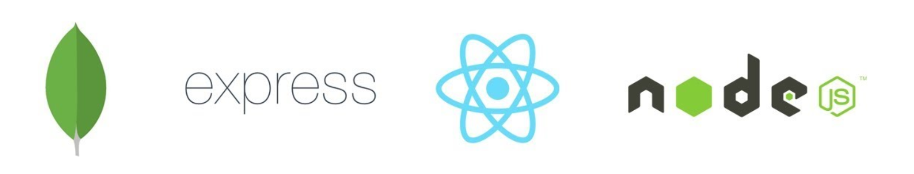

# Toothcrate-backend Coder Academy Term 3 Project -

### Frontend half (React) for a dental practice inventory system.

[Project Link](http://toothcrate.netlify.com)

* Please see [this repo](https://github.com/FilipMaslovaric/Toothcrate-backend)
  for details of the back-end.

# Table of Contents

* [Project brief](#project-brief)
* [Stacks Used](#stacks-used)
* [Problem](#client-problem)
* [Solution](#solution)
* [User Stories](#user-stories)
* [Design And Solution](#wireframes)

## Project Brief

---

####

This project was a Term-3 assignment for Coder Academy. The project brief was as
follows:

"You are to design, build, deploy and present an application built for a real
world customer.

Meet with the business owner or organisation manager to find out what challenges
they face. Find a problem that you can solve with an application and present
your ideas to the client".

## Stacks Used

---

####

* [ReactJS](https://facebook.github.io/react/): a javascript library for
  building user interfaces.
  * [NodeJS](https://nodejs.org/en/): an open-source, cross-platform JavaScript
    run-time environment for executing JavaScript code server-side.
  * [ExpressJS](https://expressjs.com/): a fast, unopinionated, minimalist web
    framework for Node.js.
  * [MongoDb](https://www.mongodb.com/): stores data in flexible, JSON-like
    documents.

---

####

Inventory management is one of the key pillars to business success. However
without a dedicated system, things have the potential to quickly spiral out of
control. Continuous monitoring of stock levels across the board helps accurate
ordering, which in turn helps to drive down overall cost and lessens the
likelihood of over/under ordering. HiQ Dental in Townsville have tasked us with
creating an automated inventory management system to track the overall stock
levels of their dental equipment from day to day, procedure to procedure. To be
included in the product is an automatic warning system to alert the practice
when an item is reaching, or has dropped below, a minimum amount. This has the
added benefit of being able to simplify the ordering process by generating a
comprehensive list of all items in the “danger zone”, which can in turn be
organized by supplier.

---
