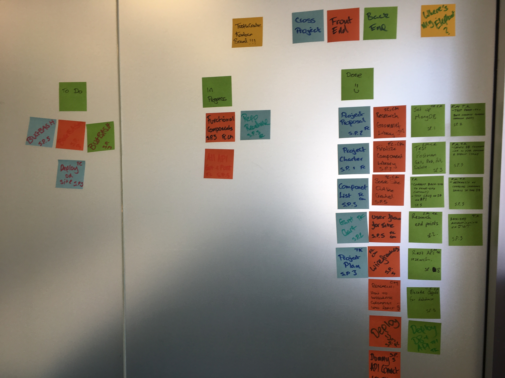
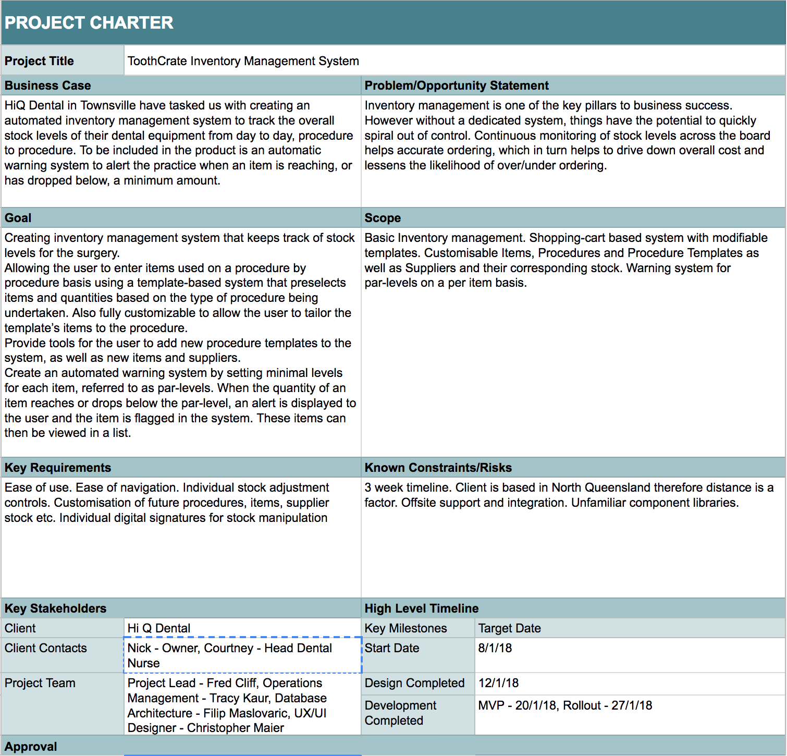
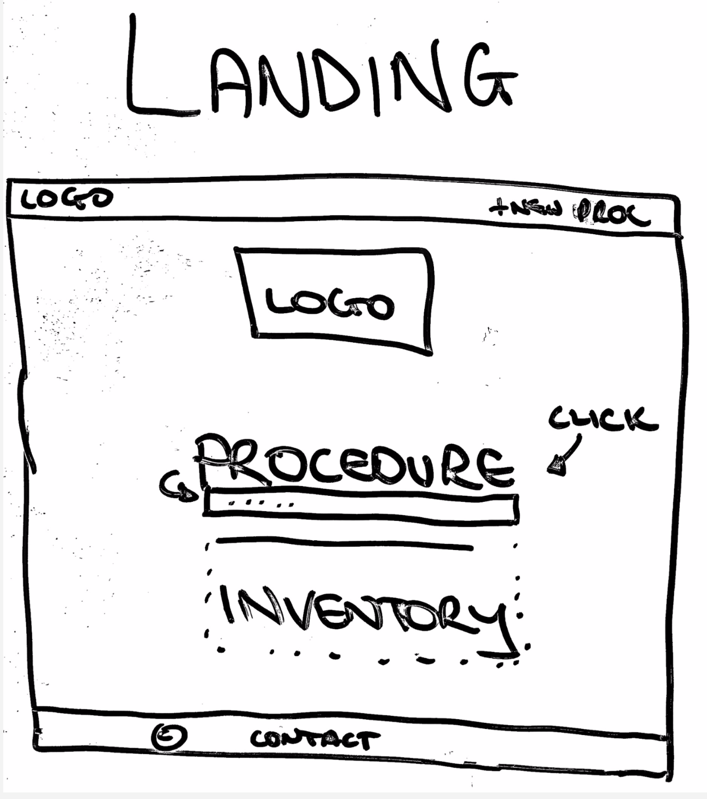
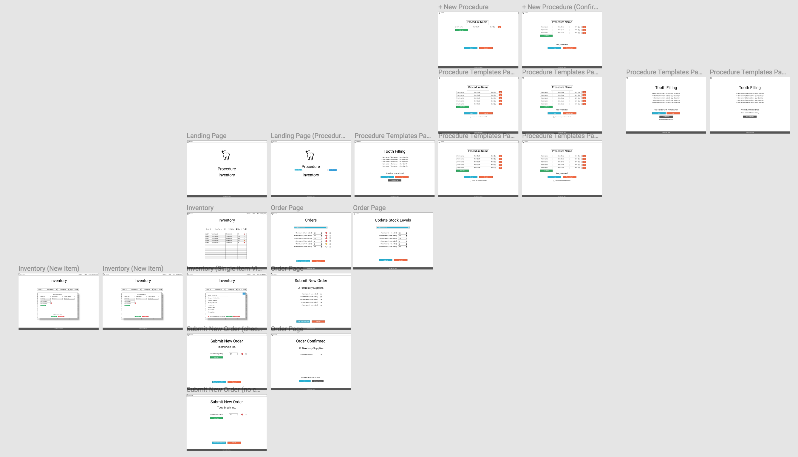
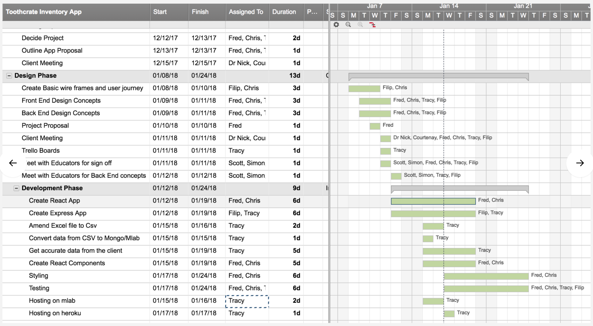

# Toothcrate-Frontend Coder Academy Term 3 Project -

### Frontend (React) for a dental practice inventory system.

[Website Link](http://toothcrate.netlify.com)

* Please see [this repo](https://github.com/FilipMaslovaric/Toothcrate-backend)
  for details of the back-end.

# Table of Contents

* [Project brief](#project-brief)
* [Problem](#client-problem)
* [Stacks Used](#stacks-used)
* [Solution](#solution)
* [User Stories](#user-stories)
* [Design](#wireframes)
* [Project Schedule](#project-schedule)

  ####

## Project Brief

---

This project was a Term-3 assignment for Coder Academy. The project brief was as
follows:

"You are to design, build, deploy and present an application built for a real
world customer.

Meet with the business owner or organisation manager to find out what challenges
they face. Find a problem that you can solve with an application and present
your ideas to the client".

####

## Problem

---

Inventory management is one of the key pillars to business success. However
without a dedicated system, things have the potential to quickly spiral out of
control. Continuous monitoring of stock levels across the board helps accurate
ordering, which in turn helps to drive down overall cost and lessens the
likelihood of over/under ordering.

HiQ Dental in Townsville have tasked us with creating an automated inventory
management system to track the overall stock levels of their dental equipment
from day to day, procedure to procedure. To be included in the product is an
automatic warning system to alert the practice when an item is reaching, or has
dropped below, a minimum amount. This has the added benefit of being able to
simplify the ordering process by generating a comprehensive list of all items in
the “danger zone”, which can in turn be organised by supplier.

####

## Stacks Used

---

### Client Technology and Development Tools:

* [ReactJS](https://facebook.github.io/react/): Client side: a javascript
  library for building user interfaces that respond in an asynchronous manner.
  This is very appropriate for the landing page as it has many components that
  need to refresh at different points which makes it so the whole page doesn’t
  have to refresh. React will be used for: landing page, sign in page, inventory
  page, procedure page and stock.

* [NodeJS](https://nodejs.org/en/): \* [ExpressJS](https://expressjs.com/):
  Server side: Node.js and Express.js - Using Node.js through Express.js is a
  quick and straightforward way to get a server api up and running with minimal
  built in features that allows the application to be customised to the project
  at hand. This will be the database api.

* [MongoDb](https://www.mongodb.com/): Database: MongoDB hosted by mlab - this
  is an industry standard online database system that has a cost-free option for
  developing applications that require data storage. Store user details:
  Username, name, email address, location (country, suburb, postcode),
  motivation, bio, badges, pictures, etc

* [Grommet](http://grommet.io): A component and design resources you need to
  take your ideas from concept to a real application.

* [Passport.js](http://www.passportjs.org/) Sign-in and authentication - this is
  authentication middleware for Node.js. It is flexible and can be used to
  connect with the client side React.js and server side Node.js for secure user
  signup and login. It can also use strategies for social media sites such as
  Facebook and Google etc.

* [Github](https://github.com/) This was used for version control, feature
  development, code storage, and project review. Code climate - this is a code
  quality tool that picks up on any issues within the code to be fixed. We
  mainly used it when I was merging a branch to the master to check the code
  quality of the branch. If there were issues we could fix them and then merge
  once they were confirmed fixed.

  Other libraries used:

- Morgan: HTTP request logger middleware for node.js.
- Mongoose: a schema based solution to model application data. Creates an easy
  to use object reference when interacting with MongoDb.
- Axios: promise based HTTP client for the browser and node.js.
- AGILE: A Kanban board was set up and used to track process: this was kept in
  the office] 

####

## Solution

---

Basic Inventory management. Shopping-cart based system with modifiable
templates. Customisable Items, Procedures and Procedure Templates as well as
Suppliers and their corresponding stock. Warning system for par-levels on a per
item basis.

1. Creating an intuitive, easy to use inventory management system that keeps
   track of stock levels for the surgery.
2. Allowing the user to enter items used on a procedure by procedure basis using
   a template-based system that preselects items and quantities based on the
   type of procedure being undertaken. This is also fully customizable to allow
   the user to tailor the template’s items to the procedure.
3. Providing tools for the user to add new procedure templates to the system, as
   well as new items and suppliers. This allows for continued growth of the
   platform.
4. Creating an automated warning system by setting minimal levels for each item,
   referred to as par-levels. When the quantity of an item reaches or drops
   below the par-level, an alert is displayed to the user and the item is
   flagged in the system. These items can then be viewed in a list, which can be
   organized by supplier for ease of ordering.

####

---

## Design

(./documentation/2procedure.png)(./documentation/3order.png)(./documentation/4inventory.png)(./documentation/5template.png)

[Click through each wire frame here](https://www.figma.com/proto/fvrA6xFB2o54G53IxiYeYahw/Toothcrate?scaling=contain&redirected=1&node-id=4%3A3)

####

---

## Project Schedule

Due to the limitations in time the scope of the project is broken up into MVP
and extra features. The core features will be the first to be implemented while
the extra features will be implemented based on the available time. The
estimation is based upon on 14 day period working 8 hours a day each day for a
total of 112 hours. It is broken down into user story points based on Agile
methodology with a production potential to complete 20 points in a week.

## Testing

## Reflections

1. It was great to create an app to solve a real world problem.
2. Great to refresh what we have learned and to apply it to the project.
3. Nice to work on new things and discuss our individual strengths .
4. Prioritise features rather than styling.
5. The whole team should have worked on the backend and then the frontend. This
   would have helped to equip the whole team to be productive on both stacks.
6. As a team we should be more open with our questions and seek help.
7. Focus on getting functionality out
8. Be careful about how much we promise to stakeholders.
